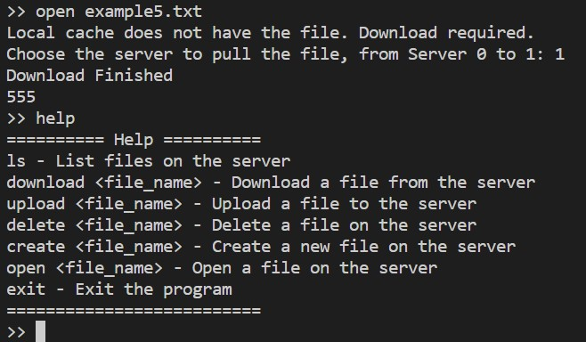

<br/>

## <center><font color = 0088ff>中山大学计算机学院 </font></center>
## <center><font color = 0088ff>分布式系统 </font></center>
## <center><font color = 008866>课程设计 —— 分布式文件系统 </font></center>

<br/>

<table>
    <tr>
        <td><b>姓名</b></td>
        <td>李骏唯</td>
    </tr>
    <tr>
        <td><b>班级</b></td>
        <td>计算机科学与技术2班</td>
    </tr>
    <tr>
        <td><b>学号</b></td>
        <td>21312378</td>
    </tr>
    <tr>
        <td><b>日期</b></td>
        <td>2023年12月31日</td>
    </tr>
</table>

<br/>
<br/>

### 1. 题目要求

（一）分布式文件系统项目

题目：
设计一个分布式文件系统。该文件系统可以是client-server架构，也可以是P2P非集中式架构。 要求文件系统具有基本的访问、打开、删除、缓存等功能，同时具有一致性、支持多用户特点。 在设计过程中能够体现在分布式课程中学习到的一些机制或者思想，例如Paxos共识、缓存更新机制、访问控制机制、并行扩展等。 实现语言不限， 要求提交代码和实验报告，实验报告模板稍后在课程网站下载，提交时间为考试之后一周内。

题目要求：
基本要求：
（1）、编程语言不限，选择自己熟悉的语言，但是推荐用Python或者Java语言实现；
（2）、文件系统中不同节点之间的通信方式采用RPC模式，可选择Python版本的RPC、gRPC等；
（3）、文件系统具备基本的文件操作模型包括：创建、删除、访问等功能；
（4）、作为文件系统的客户端要求具有缓存功能即文件信息首先在本地存储搜索，作为缓存的介质可以是内存也可以是磁盘文件；
（5）、为了保证数据的可用性和文件系统性能，数据需要创建多个副本，且在正常情况下，多个副本不在同一物理机器，多个副本之间能够保持一致性（可选择最终一致性即延迟一致性也可以选择瞬时一致性即同时写）；
（6）、支持多用户即多个客户端，文件可以并行读写（即包含文件锁）；
（7）、对于上述基本功能，可以在本地测试，利用多个进程模拟不同的节点，需要有相应的测试命令或者测试用例，并有截屏或者video支持；
（8）、提交源码和报告，压缩后命名方式为：学号_姓名_班级
（9）、实验报告长度不超过20页；
加分项：
（1）、加入其它高级功能如缓存更新算法；
（2）、Paxos共识方法或者主副本选择算法等；
（3）、访问权限控制；
（4）、其他高级功能；

<br/>

### 2. 解决思路

#### 2.1 模块介绍

本系统采用服务器-客户端架构（Client-Server）架构，其中服务器采用主从架构（Master-Slave）。使用 `xmlrpc`库实现rpc通信。整个系统由**主服务器、从服务器群、安全服务器、客户端**四个模块组成。

  

1. 主服务器（MasterServer）
   主服务器承担与客户通信、存储数据、维护文件目录、管理从服务器、同步数据到从服务器五个任务。

   - 它是用户通信的直接对象，负责给用户提供接口，如上传、下载、打开、创建、删除文件，并在本地处理完用户对文件的操作后把操作广播给所有从服务器让它们同步。
   - 此外，主服务器始终维护一个目录文件，记录着所有服务器的文件目录。
   - 当从服务器启动时，需向主服务器注册，主服务器负责维护从服务器列表；当从服务器下线后，主服务器也应检查到。
2. 从服务器（SlaveServer）
   从服务器承担与主服务器保持同步、服务客户端读操作等任务。在客户端发送下载请求给从服务器时，从服务器需要发回相应文件；在收到主服务器的同步命令时，从服务器需要执行相应操作。
3. 安全服务器（SecureServer）
   安全服务器承担两个任务：用户登录注册和文件锁的提供。
4. 客户端（Client）
   客户端以命令行的方式接收用户的键盘输入，并进行相应操作。

#### 2.2 一致性

本系统保证**顺序一致性**。在本系统中，客户端只与主服务器通信，主服务器在操作文件前需先去安全服务器处获得该文件的锁（Lock），在更新本地目录及广播操作给从服务器群后才释放锁。所以每个服务器执行操作的顺序一定一致，即保证了顺序一致性。

#### 2.3 容错与安全性

1. 容错

- 本系统容许从服务器中途异常退出，此时主服务器会在用户提交操作时检测出并将其从列表中删除。从服务器恢复后可以再次向主服务器发起注册请求。
- 本系统容许主服务器中途异常退出，此时客户端不会崩溃，而是收到服务器异常指令并安全退出。
- 本系统容许安全服务器中途异常退出，此时客户端不会崩溃，而是收到服务器异常指令并安全退出。

2. 安全性
   本系统需登录才可以进入，用户需先向安全服务器发起登录请求，验证通过后才会收到主服务器的 url，进而进入文件系统并调用RPC。

#### 2.4 缓存机制

在用户打开文件时，会缓存文件到用户目录下的cache文件夹中。缓存有上限，当缓存满而新文件来时，会删除缓存文件以腾出空间。

<br/>

### 3. 实现细节

#### 3.1 目录结构：

> - ClientFiles
>   - user1
>     - cache
>       - cachefile1
>       - cachefile2
>       - ...
>     - file1
>     - file2
>       ...
>   - user2
>   - ...
> - ServerFiles
>   - Authenticate
>     - auth.txt
>   - Master
>     - directory.txt
>     - file1
>     - file2
>     - ...
>   - Slave_1
>     - file1
>     - file2
>     - ...
>   - Slave_2
>   - ...

其中一级目录（ServerFiles和ClientFiles）是在同一主机不同进程上测试时各主目录所在的目录，多机运行时里面的各文件夹是分散在各个主机上的。

#### 3.2 流程图


#### 3.3 文件操作及容错实现
- 获取文件列表
  - 主服务器在启动时会读 `directory.txt`文件，并把它赋值给列表 `self.file_directory`，之后始终维护文件和列表。当用户请求时返回该列表。
  ```py
  # Client.py
  def list_files(self):
      try:
          files = self.proxy.list_files()
          print(f'Files on server: {", ".join(files)}')
      except Exception as e:
          print('Error get directory: Failed to connect to Master or      SecureServer')
  
  # MasterServer.py
  def list_files(self):
      return self.file_directory
  ```

- 上传、创建、删除文件
  - 上传、创建、删除文件都分为三个步骤：更新本地、广播到从服务器群、更新目录文件。
  - 提供容错，在客户端调用rpc处引入try-except机制，若有异常则说明连接不到主服务器或安全服务器。
  - 提供容错，在调用从服务器的rpc时也引入try-except机制，若检测到从服务器断连就从本地列表删除，这会不影响对其他从服务器的同步。
  ```py
  # 以上传文件为例
  
  # Client.py
  def upload_file(self, file_name):
      try:
          file_path = os.path.join(CLIENT_DIR, file_name)
          with open(file_path, 'r') as local_file:
              file_data = local_file.read()
              self.proxy.upload_file(file_name, file_data)
          print('Upload finished')
      except Exception as e:
          print('Error uploading file: Failed to connect to Master or   SecureServer')
  
  # MasterServer.py
  def upload_file(self, file_name, file_data):
      print(f'Uploading {file_name}...')
      lock_service = ServerProxy(self.secure_server_url)
      lock_service.acquire(file_name)
    
      # 写入本地
      file_path = os.path.join(self.master_dir, file_name)
      with open(file_path, 'w') as file:
          file.write(file_data)
  
      # 分发文件到其他从服务器
      print(f'Synchronizing {file_name} to the slave servers...')
      for slave_url in self.slave_urls:
          slave_proxy = ServerProxy(slave_url)
          try:
              ret = slave_proxy.upload_file(file_name, file_data)
              if not ret:
                  return False
          except Exception as e:
              # 服务器断开连接，从服务器列表删除
              print(f"Error connecting to {slave_url}: {e}")
              if slave_url in self.slave_urls:
                  self.slave_urls.remove(slave_url)
      print(f'Successfully Synchronize {file_name}')
  
      # 如果不在目录中就加上
      if file_name not in self.file_directory:
          self.file_directory.append(file_name)
          with self.dir_lock, open(os.path.join(self.master_dir, 'directory.  txt'), 'a+') as f:
              f.write(f'{file_name}\n')
  
      lock_service.release(file_name)
      print(f'Successfully upload {file_name}')
      return True
  ```

- 下载文件
  - 首先向主服务器发起请求，获得所有从服务器地址
  - 允许客户自己选择要去下载的服务器
  - 同样提供容错，若连接不到主服务器、安全服务器或目标服务器会被检测到
  ```py
  # Client.py
  
  def request_download_file(self, file_name):
      # 文件名不存在
      if file_name not in self.file_directory:
          return False
    
      # 返回所有服务器和锁服务器的url
      server_urls = copy.copy(self.slave_urls)
      server_urls.insert(0, self.master_url)
      return (server_urls, self.secure_server_url)
  
  def download_file(self, file_name, save_path='default'):
      # 接收主服务器发来的服务器url列表和安全服务器url
      try:
          info = self.proxy.request_download_file(file_name)
          if not info:
              print('Error: No such file or directory')
              return False
  
      except Exception as e:
          print('Error uploading file: {e}')
          return False
    
      # 用户键盘输入，直到输入合法为止
      while True:
          try:
              num = int(input(f'Choose the server to pull the file, from   Server 0 to {len(info[0])-1}: '))
              if 0 <= num < len(info[0]):
                  break  # 输入合法，退出循环
              else:
                  print(f'Invalid input. Please enter a number between 0 and   {len(info[0])-1}.')
          except ValueError:
              print('Invalid input. Please enter a valid number.')
  
      # 获取安全服务器和目标服务器代理
      lock_service = ServerProxy(info[1])
      download_service = ServerProxy(info[0][num])
  
      try:
          lock_service.acquire(file_name)
      except Exception as e:
          # 与安全服务器连接失败
          print(f"Error connecting to SecureServer")
          return False
  
      try:
          file_data = download_service.download_file(file_name)
      except Exception as e:
          # 与文件服务器连接失败
          print(f"Error connecting to {info[0][num]}: {e}")
          return False
  
      if not file_data:
          print('Error: No such file or directory')
      else:
          # 写入本地下载目录
          if save_path == 'default':
              save_path = os.path.join(self.client_dir, file_name)  
              # 如果缓存有该文件，则删除
              if file_name in os.listdir(self.cache_dir):
                  os.remove(os.path.join(self.cache_dir, file_name))  
                   
          with open(save_path, 'w') as local_file:
              local_file.write(file_data)
    
      try:
          lock_service.release(file_name)
      except Exception as e:
          # 与安全服务器连接失败
          print(f"Error connecting to SecureServer")
          return False
    
      print('Download Finished')
      return True
  ```

- 打开文件
  打开文件的机制稍微复杂。首先检查本地下载目录是否有该文件，如果有直接输出；否则再看缓存目录是否有，如果有也直接输出；如果没有，先调用下载接口去服务器下载该文件，然后再打开。此外，缓存有容量限制，在下载前需先检查，超过则删除其中一个文件再下载。
  ```py
  # Client.py
  
  def open_file(self, file_name):
      cache_file_path = os.path.join(self.cache_dir, file_name)
      file_path = os.path.join(CLIENT_DIR, file_name)
      # 在本地下载目录有直接打开
      if os.path.exists(file_path):
          with open(file_path, 'r') as f:
              lines = f.readlines()
              for line in lines:
                  print(line)
          return
      
      # 在本地下载目录和缓存都没有
      elif not os.path.exists(cache_file_path):
          print('Local cache does not have the file. Download required.')
          # 若缓存满则先删除一个文件
          files = os.listdir(self.cache_dir)
          if len(files) >= self.cache_capacity:
              delete_file_path = os.path.join(self.cache_dir, files[0])
              os.remove(delete_file_path)
              print(f"Cache is full, delete file: {delete_file_path}")
          # 下载文件到缓存
          if not self.download_file(file_name, cache_file_path):
              return
  
      # 打开缓存文件
      with open(cache_file_path, 'r') as f:
          lines = f.readlines()
          for line in lines:
              print(line)  
  ```

- 登录与注册
  - 安全服务器在启动时读取 `auth.txt`文件，并把它赋值给字典 `self.auth_list`，之后始终维护文件和字典。
  - 当用户注册时，检查有无相同用户名，无重复才允许注册。
  - 用户登录后返回主服务器url给客户端。
  ```py
  def login(self, username, password):
      if username not in self.auth_list:
          return False
      elif self.auth_list[username] != password:
          return False
      else:
          return self.master_url
  
  def signup(self, username, password):
      if username in self.auth_list:
          return False
    
      self.auth_list[username] = password
      with self.auth_lock, open(os.path.join(self.server_dir, 'auth.txt'), 'a  +') as f:
          f.write(f'{username} {password}\n')
      print(f'Signup: {username} {password}')
      return True
  ```

- 文件锁
  几乎所有对文件的操作都需先拿到锁，用完后释放。
  ```py
  def acquire(self, file_name):
      if file_name not in self.locks:
          self.locks[file_name] = threading.Lock()
      print(f'Try to acquire lock {file_name}')
      self.locks[file_name].acquire()
      print(f'Successfully acquire lock {file_name}')
      return True
  
  def release(self, file_name):
      if file_name in self.locks:
          self.locks[file_name].release()
          print(f'Release lock {file_name}')
          return True
      return False
  ```

<br/>

### 4. 运行情况

#### 4.1 使用方法

1. 启动主服务器
   `python MasterServer.py --port [port]`
2. 启动安全服务器
   `python SecureServer.py --port [port]`
3. 启动从服务器
   `python SlaveServer.py <slave_id> --base_port [base_port]`
4. 客户端注册
   `python Client.py signup <username> <password> --port [port]`
5. 客户端登录
   `python Client.py login <username> <password> --port [port]`
6. 文件操作
```
- ls: List files on the server
- download <file_name>: Download a file from the server
- upload <file_name>: Upload a file to the server
- delete <file_name>: Delete a file on the server
- create <file_name>: Create a new file on the server
- open <file_name>: Open a file on the server
- help: Show this help message
- exit: Exit the program
```

#### 4.2 测试运行

- 打开主服务器、安全服务器、从服务器1，注册并登录用户1

服务器和客户端目录初始状态如下：


- 展示获取文件列表、下载文件功能

结果如下，可以看到客户端已获取到example1.txt


- 展示上传、创建、删除文件功能

结果如下，可以看到example2.txt被上传到各个服务器，example3.txt在各服务器上被创建，example4.txt在各服务器上被删除


- 展示打开文件功能

结果如下，由于客户端原本没有examle5.txt，所以被下载到缓存


- 注册并登录用户2，展示并行下载

结果如下，即使两个客户端同时发送下载指令，由于有文件锁的存在，客户端只能依次等待，最终成功在两个客户端下都下载下来了example2.txt


<br/>

### 5. 遇到的问题

本次实验没有遇到太大的问题，唯一的不足就是在一开始设计系统的时候没有把整体的设计框架思考的特别完善，导致后续陆陆续续有一些bug出现，而且再想增加新功能的时候，又把一些功能重新做过，过程比较乱。

<br/>

### 6. 总结

通过这次分布式系统项目，我学到了很多关于构建分布式系统的关键概念和技术。首先，我了解了如何使用 Python 的 xmlrpc 库来实现简单而有效的远程过程调用（RPC）通信。在思考采用哪种框架时，我看到了网上多种分布式文件系统的框架模式，深刻体会到了分布式系统的多样性。在搭建的过程中，我学到了如何处理并发访问，维护一致性和使用锁机制来保护共享资源，也学会了如何在分布式系统中进行错误处理和实现容错，这些都让我对课上学习到的一致性、容错等理论知识有了更深刻的理解。最后，我在搭建客户端时学会了思考怎么样在出现错误时能够让客户有更好的体验，怎么样让在客户的角度对多服务器架构有一定的透明性。总的来说，我对分布式系统有了更深的理解，我受益良多。
